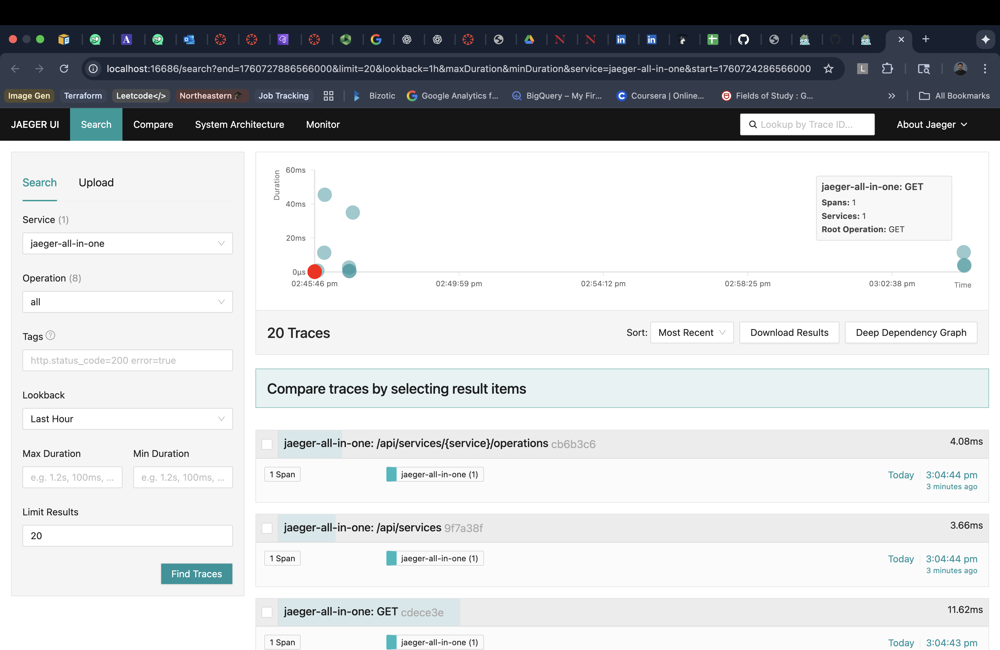
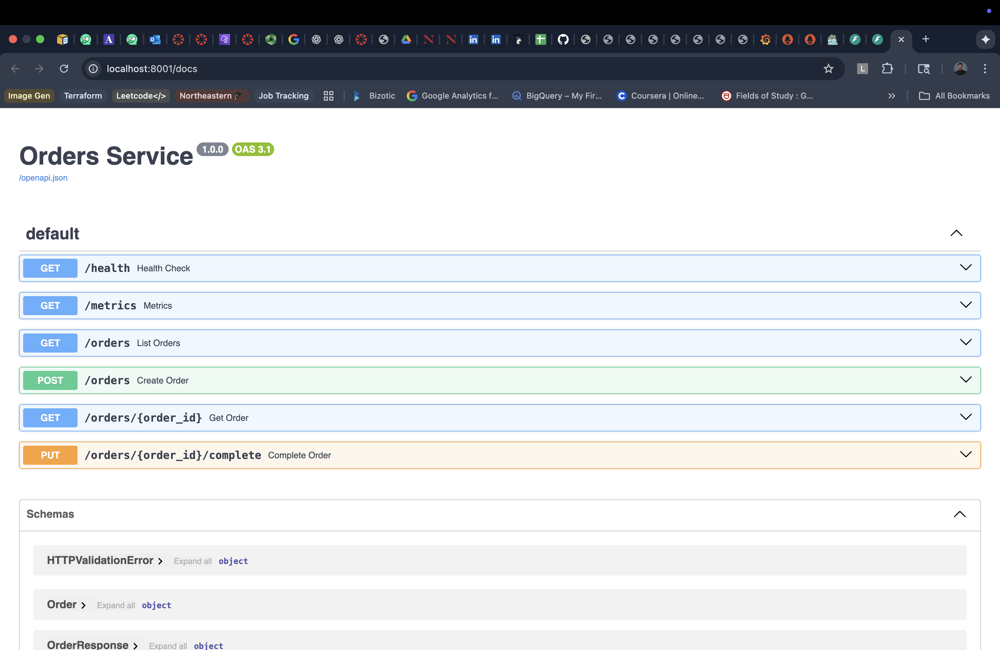

# Predictive Reliability & Auto-Remediation Platform

A comprehensive cloud-native system that monitors microservices, detects anomalies in real-time, and automatically remediates issues through intelligent policy-driven actions.

## Overview

This platform demonstrates an end-to-end Site Reliability Engineering (SRE) solution featuring:

- **Instrumented Microservices**: 3 production-ready services with built-in observability
- **Real-time Anomaly Detection**: ML-based time-series analysis for proactive issue detection
- **Automated Remediation**: Policy-driven engine that executes recovery actions automatically
- **Complete Observability Stack**: Metrics (Prometheus), Logs (Loki), Traces (Jaeger)
- **Live Dashboard**: Modern React UI for monitoring and control
- **Chaos Engineering**: Built-in failure injection for testing resilience

### Screenshots

**Dashboard Overview**


*Real-time system monitoring with service health, auto-remediation status, and quick access to observability tools*

**Anomaly Detection**


*Active anomalies detected with severity classification, confidence scores, and expected value ranges*

**Auto-Remediation Actions**


*Complete history of executed remediation actions with policy triggers and execution details*

**Policy Configuration**


*YAML-driven policy rules with configurable thresholds, actions, and cooldown periods*

## Architecture

```
┌─────────────────────────────────────────────────────────────────┐
│                         Dashboard (React)                        │
│                    http://localhost:3000                         │
└────────────────────┬────────────────────────────────────────────┘
                     │
         ┌───────────┴───────────┐
         │                       │
         ▼                       ▼
┌─────────────────┐    ┌──────────────────┐
│ Anomaly Service │    │  Policy Engine   │
│   Port 8080     │───▶│    Port 8081     │
└────────┬────────┘    └────────┬─────────┘
         │                      │
         │                      ├──► Docker API (restart containers)
         │                      └──► Alerts & Actions
         │
         ▼
┌──────────────────────────────────────────┐
│           Prometheus :9090                │
│      (Scrapes metrics every 10s)         │
└────┬─────────┬──────────┬────────────────┘
     │         │          │
     ▼         ▼          ▼
┌─────────┐ ┌──────────┐ ┌──────────────┐
│ Orders  │ │  Users   │ │  Payments    │
│  :8001  │ │  :8002   │ │   :8003      │
└─────────┘ └──────────┘ └──────────────┘
     │         │          │
     └─────────┴──────────┴──► Jaeger :16686 (Traces)
                         │
                         └──► Loki :3100 (Logs)
```

## Components

### Microservices
- **Orders Service** (Port 8001): Order management with chaos injection
- **Users Service** (Port 8002): User account management
- **Payments Service** (Port 8003): Payment processing

Each service exposes:
- `/health` - Health check endpoint
- `/metrics` - Prometheus-format metrics
- `/docs` - FastAPI Swagger documentation
- Full OpenTelemetry instrumentation for distributed tracing

### Anomaly Detection Service (Port 8080)
- Pulls metrics from Prometheus every 30 seconds
- Statistical anomaly detection using moving averages and standard deviation
- Monitors: latency (p99), error rates, CPU usage
- Classifies anomalies by severity: normal, info, warning, critical
- REST API for predictions and health status

### Policy & Auto-Remediation Engine (Port 8081)
- YAML-based policy definitions
- Continuous evaluation against detected anomalies
- Actions: `restart_container`, `scale_up`, `alert`
- Cooldown periods to prevent action spam
- Complete action history tracking
- Toggle for enabling/disabling auto-remediation

### Dashboard (Port 3000)
- **Overview**: System health, auto-remediation status
- **Anomalies**: Real-time anomaly detection and predictions
- **Actions**: Remediation action history
- **Policies**: Active policy configurations

See [Dashboard Screenshots](#screenshots) above for visual examples.

### Observability Stack
- **Prometheus** (9090): Metrics collection and time-series database
- **Grafana** (3001): Visualization and dashboards (admin/admin)
- **Loki** (3100): Log aggregation
- **Jaeger** (16686): Distributed tracing

**Monitoring Tools**


*Grafana Explore interface with Prometheus data source for metrics visualization*


*Prometheus scrape targets showing all services health status*


*Prometheus metrics query interface with time-series visualization*


*Jaeger distributed tracing interface for trace analysis*

### Chaos Simulator
Python-based tool for injecting failures:
- Random failures and latency spikes
- Traffic generation and load testing
- Chaos engineering experiments

See the [chaos_simulator/README.md](chaos_simulator/README.md) for detailed usage.

## API Documentation

All services provide interactive OpenAPI (Swagger) documentation:

**Anomaly Detection Service**


*Anomaly detection REST API with endpoints for predictions, health checks, and manual detection*

**Policy Engine**


*Policy engine REST API for status, policy management, and remediation actions*

**Microservices APIs**

<table>
  <tr>
    <td width="33%">
      
      <p align="center"><i>Orders Service API</i></p>
    </td>
    <td width="33%">
      
      <p align="center"><i>Users Service API</i></p>
    </td>
    <td width="33%">
      
      <p align="center"><i>Payments Service API</i></p>
    </td>
  </tr>
</table>

## Quick Start

### Prerequisites
- Docker & Docker Compose
- Python 3.11+ (for chaos simulator)
- 8GB+ RAM recommended
- Ports available: 3000, 3001, 8001-8003, 8080-8081, 9090, 16686

### 1. Start the Platform

```bash
# Clone or navigate to the project
cd predictive-reliability-platform

# Start all services
make up

# This will start:
# - 3 Microservices
# - Anomaly Detection Service
# - Policy Engine
# - Dashboard
# - Prometheus, Grafana, Loki, Jaeger
```

Wait 30-60 seconds for all services to initialize.

### 2. Access the Interfaces

- **Dashboard**: http://localhost:3000
- **Grafana**: http://localhost:3001 (admin/admin)
- **Prometheus**: http://localhost:9090
- **Jaeger**: http://localhost:16686
- **Anomaly API Docs**: http://localhost:8080/docs
- **Policy Engine API Docs**: http://localhost:8081/docs

### 3. Generate Traffic & Trigger Anomalies

```bash
# Generate steady load
make chaos-load

# Or inject random chaos
make chaos

# Or create a traffic spike
make chaos-spike
```

### 4. Watch the Magic Happen

1. Go to the **Dashboard** (http://localhost:3000)
2. Navigate to **Anomalies** tab - watch real-time detections
3. Check **Actions** tab - see auto-remediation in action
4. View **Grafana** for detailed metrics visualization

See the [Screenshots](#screenshots) section above for visual examples of each interface.

## Detailed Usage

### Makefile Commands

```bash
make help          # Show all commands
make up            # Start all services
make down          # Stop all services
make build         # Build Docker images
make rebuild       # Rebuild and restart
make logs          # View logs
make status        # Check service status
make health        # Health check all services
make chaos         # Inject random chaos
make chaos-load    # Generate steady load
make chaos-spike   # Generate traffic spike
make clean         # Clean everything (including volumes)
make test          # Run end-to-end test
make urls          # Display all service URLs
```

### Chaos Simulator CLI

```bash
cd chaos_simulator

# Install dependencies
pip install -r requirements.txt

# Check health of all services
python chaos.py health

# Generate load on specific service
python chaos.py load --service orders --requests 100

# Traffic spike
python chaos.py spike --service payments --duration 60

# Random chaos for 2 minutes
python chaos.py chaos --duration 120

# Steady background load for 5 minutes
python chaos.py steady --duration 300
```

### Policy Configuration

Edit `policy_engine/policies.yml`:

```yaml
policies:
  - name: "orders_high_latency_restart"
    condition: "latency > 0.5"      # Trigger when latency > 500ms
    action: "restart_container"      # Action to execute
    service: "orders"                # Target service
    cooldown: 300                    # Wait 5 minutes before repeating
    enabled: true                    # Enable/disable policy
```

Available actions:
- `restart_container`: Restart the Docker container
- `scale_up`: Scale service replicas (K8s)
- `alert`: Send alert notification

### API Examples

**Get Anomalies:**
```bash
curl http://localhost:8080/predict | jq
```

**Get Services Health:**
```bash
curl http://localhost:8080/services/health | jq
```

**Get Policy Status:**
```bash
curl http://localhost:8081/status | jq
```

**Get Remediation Actions:**
```bash
curl http://localhost:8081/actions | jq
```

**Toggle Auto-Remediation:**
```bash
curl -X POST http://localhost:8081/toggle | jq
```

## Testing End-to-End Flow

### Scenario 1: High Latency Detection & Recovery

```bash
# 1. Start the platform
make up

# 2. Generate traffic with latency spikes
make chaos-spike

# 3. Watch the dashboard
open http://localhost:3000

# Expected outcome:
# - Anomaly service detects high latency
# - Policy engine triggers restart action
# - Service recovers automatically
# - All actions logged in dashboard
```

### Scenario 2: High Error Rate

```bash
# 1. Enable chaos mode (already enabled in docker-compose)
# 2. Generate high load
cd chaos_simulator
python chaos.py load --service payments --requests 200

# 3. Monitor
# - Check Anomalies tab for error_rate anomalies
# - Check Actions tab for remediation history
# - View Grafana for error rate graphs
```

## Grafana Dashboards

Access Grafana at http://localhost:3001 (admin/admin)

Pre-configured dashboard includes:
- Service health overview
- Request latency (p99) per service
- Error rate trends
- CPU usage
- Request rate

To import additional dashboards:
1. Click "+" → "Import"
2. Upload `monitoring/grafana/dashboards/main-dashboard.json`

## Configuration

### Environment Variables

**Microservices:**
- `CHAOS_ENABLED`: Enable chaos injection (default: true)
- `FAILURE_RATE`: Probability of failures (default: 0.1)
- `LATENCY_SPIKE_RATE`: Probability of latency spikes (default: 0.15)

**Anomaly Service:**
- `PROMETHEUS_URL`: Prometheus endpoint
- `CHECK_INTERVAL`: Detection interval in seconds (default: 30)

**Policy Engine:**
- `AUTO_REMEDIATION_ENABLED`: Enable auto-remediation (default: true)
- `CHECK_INTERVAL`: Evaluation interval in seconds (default: 30)

### Adjusting Sensitivity

Edit `anomaly_service/main.py`:

```python
detector = SimpleAnomalyDetector(
    window_size=20,      # Number of historical data points
    sensitivity=2.5      # Standard deviations for threshold
)
```

Lower sensitivity = more anomalies detected  
Higher sensitivity = only severe anomalies

## Troubleshooting

### Services won't start
```bash
# Check Docker is running
docker ps

# Check port conflicts
lsof -i :3000,8001,8002,8003,8080,8081,9090

# View logs
make logs
```

### Anomalies not detected
```bash
# Verify Prometheus is scraping
open http://localhost:9090/targets

# Check anomaly service logs
docker logs anomaly-service

# Generate more traffic
make chaos-load
```

### Auto-remediation not working
```bash
# Check policy engine status
curl http://localhost:8081/status | jq

# Verify Docker socket is mounted
docker exec policy-engine ls -la /var/run/docker.sock

# Check policies are loaded
curl http://localhost:8081/policies | jq
```

### Dashboard not loading data
```bash
# Check service connectivity
docker exec dashboard ping anomaly-service
docker exec dashboard ping policy-engine

# Check nginx proxy config
docker logs dashboard
```

## Project Structure

```
predictive-reliability-platform/
├── services/
│   ├── orders_service/          # Orders microservice
│   ├── users_service/           # Users microservice
│   └── payments_service/        # Payments microservice
├── anomaly_service/             # Anomaly detection service
├── policy_engine/               # Auto-remediation engine
├── chaos_simulator/             # Chaos engineering tool
├── dashboard/                   # React TypeScript dashboard
├── monitoring/                  # Observability configs
│   ├── prometheus.yml
│   ├── loki-config.yml
│   └── grafana/
├── docker-compose.yml           # Orchestration
├── Makefile                     # Automation commands
└── README.md                    # This file
```

## Production Deployment

### AWS EKS (Terraform)

```bash
cd terraform
terraform init
terraform plan
terraform apply

# Update kubeconfig
aws eks update-kubeconfig --name predictive-reliability-cluster

# Deploy
kubectl apply -f k8s/
```

### Key Considerations

1. **Security**: Use secrets management (AWS Secrets Manager, Vault)
2. **Scaling**: Configure HPA for microservices
3. **Persistence**: Use RDS for state, EBS for Prometheus
4. **Monitoring**: Send alerts to PagerDuty/Slack
5. **Networking**: Configure ALB/NLB for ingress
6. **Observability**: Consider managed solutions (Amazon Managed Prometheus, Grafana Cloud)

## Learning Outcomes

This project demonstrates:

- **Microservices Architecture**: Service isolation, API design
- **Observability**: Metrics, logs, traces (Prometheus, Loki, Jaeger)
- **SRE Practices**: SLO/SLI monitoring, error budgets, incident response
- **Machine Learning**: Time-series analysis, anomaly detection
- **Automation**: Policy-driven remediation, self-healing systems
- **DevOps**: Docker, Docker Compose, CI/CD concepts
- **Chaos Engineering**: Failure injection, resilience testing
- **Full-Stack Development**: React, TypeScript, Python, FastAPI

## Future Enhancements

- [ ] Kubernetes deployment manifests
- [ ] Terraform modules for AWS/GCP/Azure
- [ ] Advanced ML models (LSTM, Prophet)
- [ ] Slack/PagerDuty integration
- [ ] Custom Grafana dashboards with alerts
- [ ] Service mesh integration (Istio)
- [ ] Cost optimization recommendations
- [ ] Performance profiling
- [ ] Security scanning and compliance checks

## Contributing

This is a proof-of-concept project. Feel free to:
- Fork and extend functionality
- Add new microservices
- Improve anomaly detection algorithms
- Create additional policies
- Enhance the dashboard

## License

MIT License - Feel free to use this project for learning and demonstration purposes.

## Author

Built as a comprehensive SRE/DevOps demonstration project.

## Acknowledgments

- Prometheus Project
- Grafana Labs
- Jaeger/OpenTelemetry
- FastAPI Framework
- React Community

---

**Ready to see it in action?** Run `make up` and visit http://localhost:3000!


